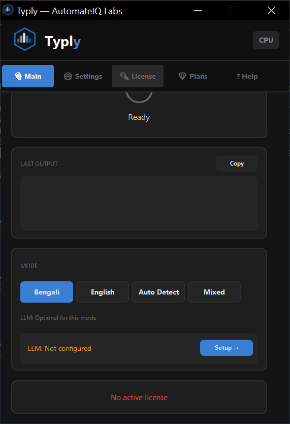
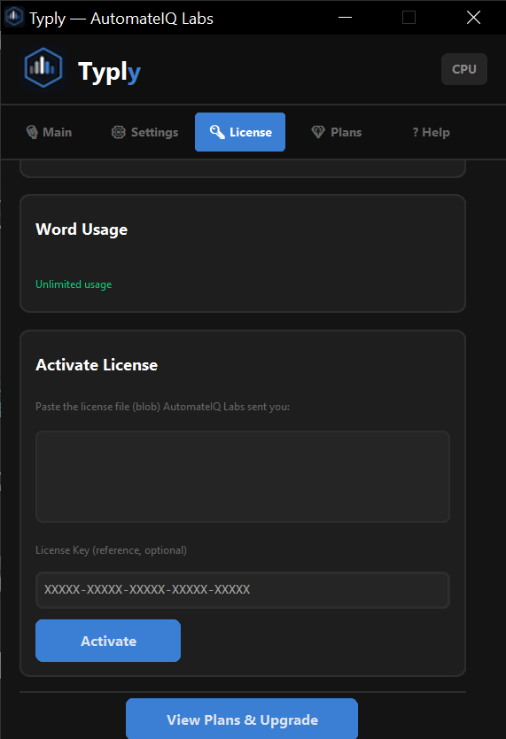
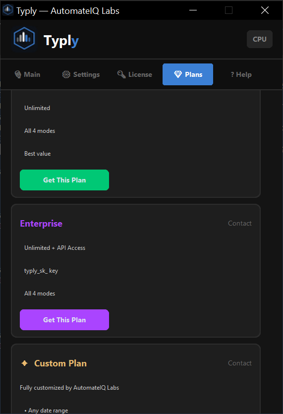
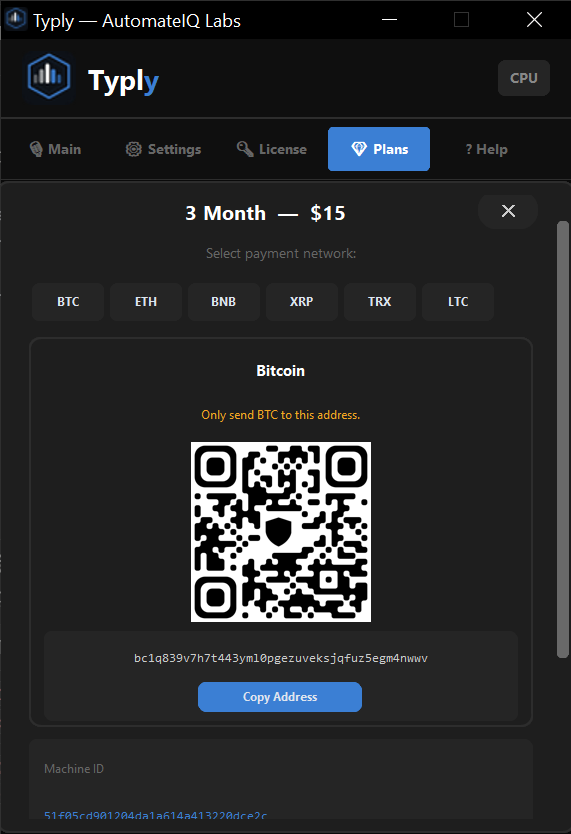
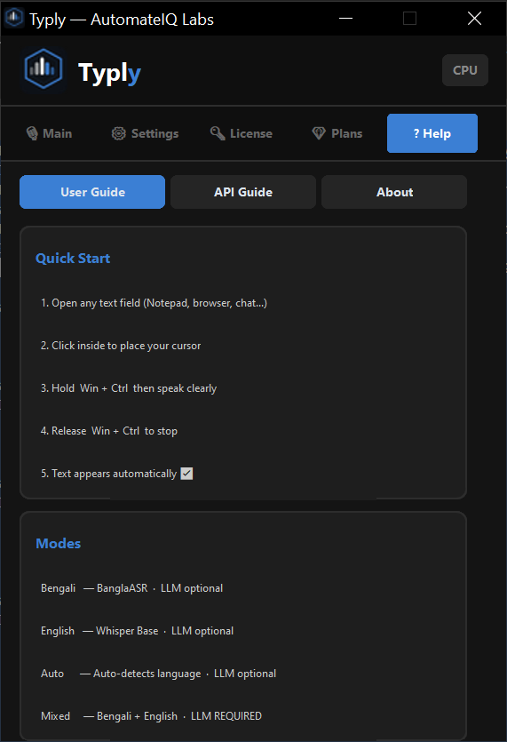
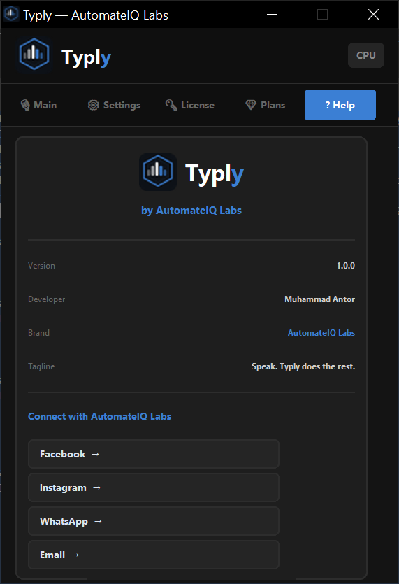

  

<h1 align="center">🎙️ Typly</h1>

<b>AI-Powered Bangla & English Voice Typing for Windows</b>

  
  
  

  <a href="#-download">⬇ Download</a> •
  <a href="#-features">✨ Features</a> •
  <a href="#-screenshots">📸 Screenshots</a> •
  <a href="#-pricing">💎 Pricing</a> •
  <a href="#-documentation">📚 Documentation</a> •
  <a href="#-contact">💬 Contact</a>

---

## About

Typly is a background voice-typing assistant for Windows. Hold **Win + Ctrl**, speak naturally in Bangla or English, release — and your words appear instantly wherever your cursor is. No app-switching, no manual recording buttons, no typing fatigue.

Built from the ground up with a custom audio pipeline, AI-enhanced transcription, and hardware-locked licensing, Typly is designed for writers, students, professionals, and anyone who thinks faster than they type.

## ✨ Features

- 🎯 **Global hotkey activation** — Hold Win+Ctrl anywhere on Windows, no app focus needed
- 🇧🇩🇬🇧 **Bangla + English + Mixed mode** — switch languages on the fly
- 🧠 **AI-powered enhancement** — optional grammar/tone polishing via 9+ LLM providers (bring your own API key)
- ⚡ **GPU-accelerated transcription** — automatic NVIDIA GPU detection for faster results (CPU fallback fully supported)
- 🔒 **Hardware-locked licensing** — tamper-resistant, tied to your machine
- 📊 **Live usage tracking** — daily/weekly word usage visible inside the app
- 🖥️ **Lightweight system tray presence** — runs quietly in the background

## 📸 Screenshots

| Main Screen | License | Plans |
|---|---|---|
|  |  |  |

| Payment | Help | System Tray |
|---|---|---|
|  |  |  |

## 💎 Pricing

| Plan | Duration | Price |
|---|---|---|
| Trial | 7 days | Free |
| 1 Month | 30 days | $6 |
| 3 Month | 90 days | $15 |
| 6 Month | 180 days | $35 |
| Enterprise | 365 days (API access included) | $80 |

> Payment accepted via crypto (BTC, ETH, BNB, XRP, TRX, LTC) and other methods. Message us on Facebook / WhatsApp / Email with your Machine ID (visible inside **Settings**) to receive payment instructions.

## ⬇ Download

**[⬇ Download Typly for Windows](https://github.com/muhammadantor/typly-bangla-voice-typing/releases/tag/v1.0.0)**

> ⚠️ Typly is an independently-signed build. Windows SmartScreen or your antivirus may show a warning on first launch — this is expected for independently-distributed software, not a sign of malware. Click **"More info" → "Run anyway"** to proceed.

## 🖥️ System Requirements

| Requirement | Minimum |
|---|---|
| OS | Windows 10 / 11 (64-bit) |
| CPU | Intel i3 6th Gen or equivalent |
| RAM | 8 GB |
| Internet | Required on first launch only (~250MB model download) |
| GPU | Optional — NVIDIA GPU for acceleration (CPU works fine without it) |

## ⚠️ Good to Know (Not Bugs)

- **Administrator permission is required every launch** — Typly needs elevated rights to register its global hotkey system-wide. This is a Windows security requirement, not a malfunction.
- **The "Launch app now" checkbox after install may not open Typly** — due to the same permission requirement. Please open Typly manually from the Desktop shortcut after installation.
- **Auto-start with Windows may not always trigger reliably** — for the same reason. A workaround is covered in the installation guide.
- **GPU acceleration is NVIDIA-only** — AMD/Intel GPU users run in CPU mode automatically. Fully functional, just not GPU-accelerated.

## 📚 Documentation

| Doc | Covers |
|---|---|
| `docs/ENGINEERING.md` | Full engine pipeline — audio capture, chunking, transcription, AI enhancement |
| `docs/SECURITY.md` | License & security architecture |
| `docs/INSTALLATION.md` | Step-by-step install & setup guide |
| `docs/COMPARISON.md` | Typly vs. traditional voice-typing tools |
| `docs/FAQ.md` | Troubleshooting & common questions |

*(Links will activate once each doc is published in the `docs/` folder.)*

## 🔐 License

Typly is proprietary, closed-source software. This repository is for **distribution and documentation only** — no source code is published here.

❌ **Not Permitted:** reverse engineering, decompiling, redistribution, or license circumvention.

## 💬 Contact

📘 Facebook: [facebook.com/automateiq.labs](https://facebook.com/automateiq.labs)
📱 WhatsApp: +880 1959-884930
📧 Email: muhammadantor71@gmail.com
📸 Instagram: [instagram.com/automateiq.labs](https://instagram.com/automateiq.labs)

---

Built by <b>AutomateIQ Labs</b> — Muhammad Antor

